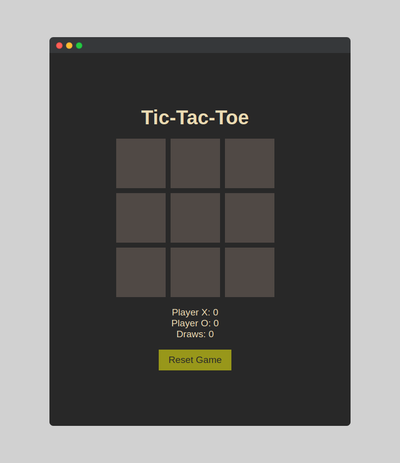

# 🎉 Tic-Tac-Toe 🕹️

Welcome to my **Tic-Tac-Toe** game! This is a fun, minimalist, and modern implementation of the classic game we all know and love. Whether you're here to sharpen your strategy or just kill some time, this project has got you covered!

## 🚀 Features
- **Responsive Design**: Looks great on all devices, whether you're on a desktop, tablet, or phone.
- **Smooth Animations**: Subtle animations to make your gameplay experience delightful.
- **Score Tracking**: Keeps track of wins, losses, and draws.
- **Dark Mode**: Dark mode inspired my Gruvbox inspired!.

## 📸 Screenshots

*Screenshot of the game in action!*

## 🛠️ Technologies Used
- **Frontend**: HTML, CSS, JavaScript
- **Styling**: CSS
- **Frameworks**: Vanilla JavaScript

## 🕹️ How to Play
1. Clone this repository to your local machine:
   ```sh
   git clone https://github.com/codewithsarthak-2009/Tic-Tac-Toe.git
   ```
2. Navigate into the project directory:
   ```sh
   cd Tic-Tac-Toe
   ```
3. Open the `index.html` file in your favorite browser and enjoy the game!

## 🌟 Inspiration & Credits
This project was built with the help of [ChatGPT](https://www.openai.com/chatgpt), who assisted in planning and implementing the game logic and design. Big thanks to this awesome AI!

## 👨‍💻 About Me
I'm a beginner (noob) developer who loves experimenting with web development and games. You can check out more of my work and get in touch with me on my [portfolio website](https://codewithsarthak-2009.github.io/).

## 🤝 Contributing
Got a cool idea or found a bug? Feel free to fork the project and submit a pull request. Let's make this game even better together!

## 📬 Contact
You can reach me on:
- **Twitter**: [@codewithsarthak](https://twitter.com/codewithsarthak)
- **Email**: codewithsarthak@proton.me

## ⚖️ License
This project is licensed under the MIT License - see the [LICENSE](LICENSE) file for details.

---

Enjoy the game! Have fun, and don't forget to ⭐️ the repo if you like it!
